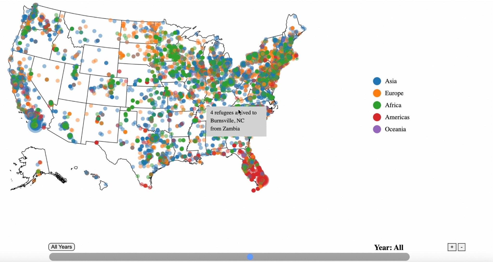

Data Visualization project contextualizing periods of refugee resettlement in the US since 1975. 

Group Project for INFO 3300 at Cornell University.

Stigma surrounding refugees and migrants is a very present aspect of American politics.
To counter those abstractions and generalizations, we used geocoded data
from the Office of Refugee Resettlement and the Bureau for Population, Refugees, and Resettlement
to show the specifics of refugee placement between 1975 and 2018. We urge viewers to notice patterns
in continental refugees over time and in settlement location. The data represents the resettlement
of just under one million refugees from 94 distinct countries to all 50 states.

Take a look and think about the visibility of refugees in your location as coworkers, neighbors, and friends.

